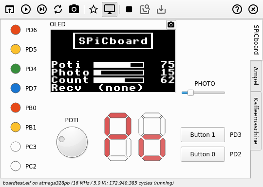

# SPiCsim 3.1

Replacement for the [SPiCboard](https://www4.cs.fau.de/Lehre/SS19/V_SPIC/SPiCboard/) [Simulator](https://www4.cs.fau.de/Lehre/SS19/V_SPIC/SPiCboard/spicsim.shtml), which was based on the (discontinued) [Avrora](http://compilers.cs.ucla.edu/avrora/).

## Features

 * Modern UI (with different Skins)
 * And Terminal UI (Ascii and Unicode)!
 * *C/C++* instead of *Java/Scala*
 * Based on [simavr](https://github.com/buserror/simavr) and [Qt](https://www.qt.io/)
 * Fully supporting [ATmega328PB](http://ww1.microchip.com/downloads/en/DeviceDoc/40001906A.pdf)
 * Correct LED Lightness simulation
 * Noise in ADC simulation
 * Support for OLED Display ([SSD1306](https://cdn-shop.adafruit.com/datasheets/SSD1306.pdf))
 * GDB Support
 * Logic Analyzer like Value Change Dump

## Build

Make sure to checkout the *simavr* submodule and run *Make*

    git submodule update --init --recursive
    make

### Install

Install on local machine via

    sudo make install

### Distribute in CIP

Install in CIP after build with

    make install-cip

## Usage

    ./spicsim [OPTIONS] ELFFILE

where ``ELFFILE`` is the path to an AVR ELF.
The available options are listed in the help output (option ``-h``).

